# Query 流转 Trace · 一条真实 query 的全链路

> 掌柜出品。线级 trace —— 把一次完整的 `POST /api/query` 请求展开成可逐步追的状态转移链。
> 配套图：[README.md §0 全图速览](../docs/architecture/README.md)、§1 Data Graph 17 节点。

---

## 0. 输入 & 出口形式

**HTTP 请求：**
```http
POST /api/query
Content-Type: application/json
Cookie: session_id=<uuid>

{
  "query": "统计 2025 年第一季度各大区的 GMV",
  "use_multi_agent": false
}
```

**路由入口：** [app/api/routers/query_router.py](../app/api/routers/query_router.py) 的 `query_handler`
- 根据 `use_multi_agent` 选 `query_service.query`（legacy 17 节点）或 `query_service.query_multi_agent`（supervisor）
- 本例 `use_multi_agent=false` → legacy 路径

**响应格式：** SSE 流（text/event-stream），每个 chunk 是 LangGraph `runtime.stream_writer` 写入的 dict：
```json
{"type": "progress", "step": "意图分类", "status": "running"}
{"type": "progress", "step": "意图分类", "status": "success"}
// ... 16 个类似事件 ...
{"type": "sql", "data": "SELECT region, SUM(order_amount) ..."}
{"type": "result", "data": [{"region": "华北", "gmv": 1234567.89}, ...]}
```

---

## 1. 初始状态

进入 graph 前的 state（[app/agent/state.py: DataAgentState](../app/agent/state.py) TypedDict）：

```python
{
    # ── 用户输入 ──
    "query":       "统计 2025 年第一季度各大区的 GMV",
    "history":     [],                       # 本例无上下文
    "intent":      <unset>,                  # 下游节点写
    "time_range":  <unset>,                  # rewrite_query 写
    "inherited_from_history": <unset>,
    "query_intent": <unset>,

    # ── 召回阶段 ──
    "keywords":                 <unset>,
    "retrieved_column_infos":  [],
    "retrieved_metric_infos":  [],
    "retrieved_value_infos":   [],

    # ── 生成阶段 ──
    "table_infos":  <unset>,
    "metric_infos": <unset>,
    "date_info":    <unset>,
    "db_info":      <unset>,
    "sql":          <unset>,
    "error":        None,                    # 默认 None

    # ── Multi-Agent 字段（本路径下都是 None/0） ──
    "plan": None, "sub_results": [], "final_response": None,
    "confidence": None, "review_action": None,
    "review_loop_count": 0, "cached_pre_state": None,
}
```

**LangGraph 合并策略：** 每个节点返回的 dict 会**覆盖/新增**到 state 上（同 key 覆盖，空 list 默认值不会被清空）。

---

## 2. 流转控制图（仅本例走的节点）

```mermaid
flowchart LR
    S([▶ START]) --> CI[classify_intent<br/>🟡 cheap]
    CI -->|intent=data_query| RW[rewrite_query<br/>🟦 strong]
    RW --> EK[extract_keywords<br/>🟦 strong]

    EK --> RCL[recall_column<br/>⚪ Qdrant]
    EK --> RV[recall_value<br/>⚪ ES]
    EK --> RMT[recall_metric<br/>⚪ Qdrant]

    RCL --> MR[merge_retrieved_info<br/>⚪ + MySQL meta]
    RV --> MR
    RMT --> MR

    MR --> FT[filter_table<br/>🟦 strong]
    MR --> FM[filter_metric<br/>🟦 strong]

    FT --> AX[add_extra_context<br/>⚪ + MySQL dw]
    FM --> AX

    AX --> GI[generate_intent<br/>🟦 strong]
    GI --> GS[generate_sql<br/>⚪ 纯渲染·无 LLM]
    GS --> VS[validate_sql<br/>🔴 + MySQL EXPLAIN]

    VS -->|error is None| RS[run_sql<br/>🔴 + MySQL dw]
    VS -->|error exists| CS[correct_sql<br/>🟦 strong]

    CS --> RS
    RS --> E([■ END])

    classDef cheap fill:#fff7e0,stroke:#d8a000
    classDef strong fill:#e6f2ff,stroke:#3b6fb0
    classDef safety fill:#ffe5e5,stroke:#c33
    classDef pure fill:#f0f0f0,stroke:#888,stroke-dasharray:4 3

    class CI cheap
    class RW,EK,FT,FM,GI,CS strong
    class VS,RS safety
    class RCL,RV,RMT,MR,AX,GS pure
```



🟡 cheap = 用小模型 ｜ 🟦 strong = 用大模型 ｜ ⚪ 纯代码/数据库 ｜ 🔴 关键校验

---

## 3. 逐节点 trace

### Node 1 · classify_intent
📄 [app/agent/nodes/classify_intent.py](../app/agent/nodes/classify_intent.py)

| 项 | 详情 |
|---|---|
| **Profile** | 🟡 **cheap** (`get_llm("classify_intent")`) |
| **Prompt** | [prompts/classify_intent.prompt](../prompts/classify_intent.prompt) |
| **Reads** | `state["query"]` |
| **IO** | 1 cheap LLM call (~1.0–2.0s) |
| **Writes** | `state["intent"]` |
| **Stream** | `progress: "意图分类"` running → success |

**State diff：**
```python
{
    "intent": "data_query",        # 用户 query 不闲聊、不问元数据
}
```

**关键观察：** cheap 模型 + 严格 few-shot rule（边界例子都在 prompt 里）→ 输出稳定。**没有这段 prompt 里列出的明确规则时，cheap 模型容易把 "GMV 是什么" 和 "GMV 是多少" 混。**

---

### Node 2 · rewrite_query
📄 [app/agent/nodes/rewrite_query.py](../app/agent/nodes/rewrite_query.py)

| 项 | 详情 |
|---|---|
| **Profile** | 🟦 **strong** |
| **Prompt** | [prompts/rewrite_query.prompt](../prompts/rewrite_query.prompt) |
| **Reads** | `query`, `history` |
| **IO** | 1 strong LLM call (~2.0–3.5s) + Python `datetime` 计算 |
| **Writes** | `state["query"]`（**原句，不动**）、`time_range`、`inherited_from_history` |

**State diff：**
```python
{
    # query 字段保留原句 (RFC 刀1 关键改造)
    "query": "统计 2025 年第一季度各大区的 GMV",

    # Python datetime 算出来，不是 LLM 算的
    "time_range": {
        "start_date": "2025-01-01",
        "end_date": "2025-03-31",
        "raw_expression": "2025年第一季度",
    },

    # 历史空 → 全空（继承机制是为多轮对话设计的）
    "inherited_from_history": {
        "entities": [],
        "conditions": [],
        "dimensions": [],
    },
}
```

**关键观察：**
- `state["query"]` **永不被改写节点覆盖**——这是 [state.py 顶部注释](../app/agent/state.py) 明说的"RFC 刀1 关键约束"。下游所有节点拿到的都是用户原句。
- 时间具体起止用 Python `date()` 算（LLM 算月份会跨年出错）→ 这是 **少调 LLM 的工程化做法**，把 LLM 严格限制在"语义"层。

---

### Node 3 · extract_keywords
📄 [app/agent/nodes/extract_keywords.py](../app/agent/nodes/extract_keywords.py)

| 项 | 详情 |
|---|---|
| **Profile** | 🟦 **strong** |
| **Prompt** | [prompts/extend_keywords_for_column_recall.prompt](../prompts/extend_keywords_for_column_recall.prompt) 等 3 个 |
| **Reads** | `query`, `keywords`（初始空） |
| **IO** | 1 strong LLM call + jieba 分词（[conf/jieba_userdict.txt](../conf/jieba_userdict.txt) 业务词典） |
| **Writes** | `state["keywords"]` |

**State diff：**
```python
{
    "keywords": ["GMV", "大区", "第一季度", "2025"],   # LLM 扩展 + jieba 切
}
```

**重点：** 这一步**还会做"关键词扩展"**——LLM 看到原 query，会把"GMV"扩展出 ["GMV", "销售额", "成交额", "总营业额"] 之类的同义词，给下游召回提高 hit rate。

---

### Nodes 4/5/6 · 三路召回（fan-out 并行）
📄 [recall_column.py](../app/agent/nodes/recall_column.py) · [recall_value.py](../app/agent/nodes/recall_value.py) · [recall_metric.py](../app/agent/nodes/recall_metric.py)

| 项 | 详情 |
|---|---|
| **Profile** | ⚪ 纯代码 / 0 LLM（但 recall_column 和 recall_metric 需要 embedding） |
| **Reads** | `keywords` |
| **IO** | 1 embedding（cheap/strong 都可能）+ Qdrant×2 (column/metric) + ES×1 (value)，**并行** |
| **Writes** | `retrieved_column_infos`, `retrieved_value_infos`, `retrieved_metric_infos` |

**三路并行机制：** LangGraph 在 `extract_keywords → recall_{column,value,metric}` 这一段是 fan-out，三个节点**同时启动**，各自独立 IO。
- `recall_column`：`embedding(keywords)` → Qdrant.search(vector) → top-K ColumnInfo
- `recall_value`：jieba 分词后的 keywords → ES.term match → top-K ValueInfo
- `recall_metric`：`embedding(keywords)` → Qdrant.search(vector) → top-K MetricInfo
- 共用 helper：[app/agent/nodes/_recall_helpers.py](../app/agent/nodes/_recall_helpers.py) 提供 `parallel_recall_dedup`（并行 + 去重 + 异常隔离）

**State diff：**
```python
{
    "retrieved_column_infos": [
        # 列向量召回 top-K（通常 top=20，"销售额"、"region"、"订单号"等）
        ColumnInfo(column_name="order_amount", table="fact_order", score=0.93, ...),
        ColumnInfo(column_name="region",      table="dim_region", score=0.88, ...),
        ColumnInfo(column_name="order_date",   table="fact_order", score=0.74, ...),
        # ... 17 个
    ],
    "retrieved_value_infos": [
        # ES 精确枚举值
        ValueInfo(value="2025-Q1", source_column="quarter", ...),
        ValueInfo(value="华东", source_column="region", ...),
        # ... 5 个
    ],
    "retrieved_metric_infos": [
        # 指标向量召回
        MetricInfo(name="GMV", description="成交总额", relevant_columns=["order_amount"], ...),
        # ... 4 个
    ],
}
```

**关键观察：**
- **三路并行省时间** —— 序列化 600ms，并行 200-300ms（`docs/architecture/README.md §1` 时序图标注的"隐藏提速点"）
- **混合检索的真正价值** —— Qdrant 召回语义（"GMV ≈ order_amount"），ES 召回精确值（"华东"这种枚举向量太近会互相误伤）

---

### Node 7 · merge_retrieved_info
📄 [app/agent/nodes/merge_retrieved_info.py](../app/agent/nodes/merge_retrieved_info.py)

| 项 | 详情 |
|---|---|
| **Profile** | ⚪ 纯代码 |
| **Reads** | 3 个 `retrieved_*_infos` |
| **IO** | Meta MySQL 补齐（按 column_id / metric_id 反查 description / 主外键 / 表结构） |
| **Writes** | `table_infos`, `metric_infos` |

**机制：**
1. 把 3 路召回的 id 集合并去重
2. 对 column id 列表 → Meta MySQL 查 `column_info` 表拿 description/role/主键
3. 对 table id → Meta MySQL 查 `table_info` 表拿全 schema
4. 对 metric id → Meta MySQL 查 `metric_info` 表拿 definition/relevant_columns

**State diff：**
```python
{
    "table_infos": [
        {
            "name": "fact_order",
            "role": "fact",
            "description": "订单事实表",
            "columns": [
                {"name": "order_amount", "type": "decimal(18,2)", "role": "measure",
                 "examples": [123.45, 6789.0], "description": "订单金额（元）", "alias": ["销售额"]},
                {"name": "order_date", "type": "date", "role": "dimension", ...},
                {"name": "region_id", "type": "int", "role": "foreign_key", ...},
                # ...
            ],
        },
        {"name": "dim_region", "role": "dimension", ...},
    ],
    "metric_infos": [
        {
            "name": "GMV",
            "description": "成交总额 = SUM(order_amount) WHERE order_status IN ('paid','shipped')",
            "relevant_columns": ["order_amount"],
            "alias": ["销售额", "成交额"],
        },
        # ...
    ],
}
```

**隐患：** 这里可能有 **N+1 查询**——column 召回 20 个，每个都要查 description。值得改成 `WHERE id IN (...)` 一次查完。`REVIEW.md` 里 R7 提到测试覆盖时捎带了一下。

---

### Nodes 8/9 · filter_table + filter_metric（并行）
📄 [filter_table.py](../app/agent/nodes/filter_table.py) · [filter_metric.py](../app/agent/nodes/filter_metric.py)

| 项 | 详情 |
|---|---|
| **Profile** | 🟦 **strong** × 2（并行） |
| **Prompts** | [filter_table_info.prompt](../prompts/filter_table_info.prompt) · [filter_metric_info.prompt](../prompts/filter_metric_info.prompt) |
| **Reads** | `query`, `table_infos` / `metric_infos` |
| **Writes** | 过滤后的 `table_infos` / `metric_infos` |

**机制：** 把候选表/指标转成 YAML（`yaml.dump`）塞 prompt，让 LLM **只返回保留的 name 列表**。裁剪动作（`保留哪些` + `丢弃哪些`）由 Python 在节点末尾执行，不是 LLM 干。

**为什么用 YAML：** YAML 比 JSON 缩进更易读，对中文字段描述友好，且 jinja2 模板里 `{{ table_infos | to_yaml }}` 渲染稳定（f-string 在换行时会破坏 YAML 缩进，2026-07-17 改造原因）。

**State diff：**
```python
{
    "table_infos": [
        # 从 ~3 张候选表剪到 1 张 fact_order（dim_region 被 join 进 column 里）
        {
            "name": "fact_order",
            "columns": [
                {"name": "order_amount", ...},
                {"name": "order_date", ...},
                {"name": "region_id", ...},  # 保留外键
            ],
        },
    ],
    "metric_infos": [
        # 从 ~4 候选剪到 1 个 GMV
        {"name": "GMV", "expression": "SUM(order_amount)", ...},
    ],
}
```

**这是个有 guard 的裁剪** —— LLM 选，Python 删。即便 LLM 输出格式坏了，Python 还能根据返回的 name 列表做幂等裁剪，比 LLM 直接改 schema 安全。

---

### Node 10 · add_extra_context
📄 [add_extra_context.py](../app/agent/nodes/add_extra_context.py)

| 项 | 详情 |
|---|---|
| **Profile** | ⚪ 纯代码 |
| **Reads** | （不需要 state 字段） |
| **IO** | DW MySQL `get_db_info()`（一次性探活） + Python `date.today()` |
| **Writes** | `date_info`, `db_info` |

**State diff：**
```python
{
    "date_info": {
        "date": "2026-07-22",           # 当前日期
        "weekday": "Wednesday",
        "quarter": "Q3",                # 重要：今天的"季度"用于相对时间推断
    },
    "db_info": {
        "dialect": "mysql",
        "version": "8.0.32",
    },
}
```

**为什么需要这个：** 让 `generate_intent` 节点的 LLM 知道"今天"是哪天——否则 "上个月销量" 这种相对表达无解。"Q3" 也给 LLM 一个明确的当前季度，方便它推算季度边界。

---

### Node 11 · generate_intent ⭐ 关键节点
📄 [generate_intent.py](../app/agent/nodes/generate_intent.py)

| 项 | 详情 |
|---|---|
| **Profile** | 🟦 **strong** |
| **Prompt** | [prompts/generate_intent.prompt](../prompts/generate_intent.prompt) |
| **Parser** | `PydanticIntentParser`（[app/core/pydantic_parser.py](../app/core/pydantic_parser.py)）—— 强类型校验 |
| **Reads** | `query`, `time_range`, `inherited_from_history`, `table_infos`, `metric_infos`, `date_info`, `db_info` |
| **IO** | 1 strong LLM call (~3.0–5.0s) |
| **Writes** | `state["query_intent"]: dict` |

**机制：** LLM 只干"语义层"——输出**业务意图的 JSON 中间表示**。不写 SQL 语法。

**State diff：**
```python
{
    "query_intent": {
        "selected_tables": [
            {"table": "fact_order", "join_path": []},
        ],
        "selected_metrics": [
            {"name": "GMV", "expression": "SUM(order_amount)"},
        ],
        "filters": [
            {"column": "order_date", "op": "BETWEEN",
             "value": ["2025-01-01", "2025-03-31"]},   # 来自 time_range
        ],
        "group_by": [
            {"column": "region_id"},
        ],
        "order_by": [],
        "limit": null,
        "inherited_entities": [],
        "inherited_conditions": [],
        "inherited_dimensions": [],
    },
}
```

**这是 2026-07-14 RFC 刀1 的核心改造：**
- 改前：让 LLM 在 `generate_sql` 一步同时干 "理解业务 + 写 SQL 语法"，失败率 30%+
- 改后：LLM 只输结构化 JSON → 下游 `generate_sql` 用 jinja2 模板**确定性渲染** → 语法错基本消失
- LLM 出错时强制 Pydantic 校验失败 → fallback empty intent → `generate_sql` 用 `SELECT 1` 兜底
- **最大收益：** 错误归因清晰——"SQL 语法错" vs "业务意图错" 一眼能区分

---

### Node 12 · generate_sql ⭐ 纯渲染
📄 [generate_sql.py](../app/agent/nodes/generate_sql.py)

| 项 | 详情 |
|---|---|
| **Profile** | ⚪ **纯 Python · 0 LLM** |
| **Reads** | `query_intent` |
| **IO** | None（纯内存操作）~5-10ms |
| **Writes** | `state["sql"]: str` |

**机制：** `sql_template.render_sql(query_intent)` → jinja2 模板填充 → 输出 SQL 字符串。

**State diff：**
```python
{
    "sql": (
        "SELECT region_id AS region, SUM(order_amount) AS gmv "
        "FROM fact_order "
        "WHERE order_date BETWEEN '2025-01-01' AND '2025-03-31' "
        "GROUP BY region_id "
        # LIMIT 由 inherited 决定，本例没有
    ),
}
```

**关键：这一步不调 LLM。** 这是 RFC 刀1 的另一极。SQL 渲染 100% 由 Python 代码控制——关键字大小写、缩进、JOIN 顺序都由模板决定，不会因为 LLM 抽风出现 "select * FROM order" 这种一致性问题。

---

### Node 13 · validate_sql ⭐ 安全闸
📄 [validate_sql.py](../app/agent/nodes/validate_sql.py)

| 项 | 详情 |
|---|---|
| **Profile** | ⚪ + 🔴 DW MySQL |
| **Reads** | `sql` |
| **IO** | DW MySQL: `EXPLAIN <sql>`（只解析，不执行）~30-100ms |
| **Writes** | `state["error"]: str | None` |

**机制：** DW MySQL 用 `EXPLAIN` 而不是真跑——只让 MySQL 解析语法和找 schema 引用。真正的"行级执行"留给 `run_sql`。

**State diff：**
```python
{
    "error": None,    # 通过的情况
    # 如果失败：
    # "error": "Unknown column 'order_date' in 'where clause'"
}
```

**失败时不抛异常** —— 把错误字符串写进 state，让 LangGraph 的条件边（`graph.py:146-150`）把控制流转到 `correct_sql` 节点。这是典型的"图状态机"优雅处理：失败也是一个状态，不是异常。

---

### 分支 · 校验通过 (本例路径)

**Node 14 (Final) · run_sql**
📄 [run_sql.py](../app/agent/nodes/run_sql.py)

| 项 | 详情 |
|---|---|
| **Profile** | ⚪ + 🔴 DW MySQL |
| **Reads** | `sql` |
| **IO** | DW MySQL: 三层安全校验 → execute |
| **Writes** | (通过 stream chunk 返回，不进 state) |

**3 层防火墙** ([app/core/sql_safety.py](../app/core/sql_safety.py))：
1. **关键字黑名单**：DROP/DELETE/UPDATE/INSERT/ALTER/TRUNCATE
2. **只读白名单**：只接受以 SELECT / WITH 开头
3. **注入检测**：UNION SELECT、`OR '1'='1'`、`--` 注释截断

外加 `_clean_sql` 剥 markdown 围栏（LLM 可能输出 ```` ```sql ... ``` ````）。

**Stream output（不进 state）：**
```python
# 通过 stream_writer 写，不是 state
writer({"type": "sql", "data": "SELECT ..."})
writer({"type": "result", "data": [
    {"region": "华北", "gmv": 12345678.90},
    {"region": "华东", "gmv": 18765432.10},
    {"region": "华南", "gmv": 9876543.21},
]})
```

→ END

---

### 分支 · 校验失败 (备选路径)

**Node 13.5 · correct_sql**
📄 [correct_sql.py](../app/agent/nodes/correct_sql.py)

| 项 | 详情 |
|---|---|
| **Profile** | 🟦 **strong** |
| **Reads** | `sql`, `error`, `query`, `table_infos`, `metric_infos`, `date_info`, `db_info` |
| **IO** | 1 strong LLM call (~3.0–5.0s) |
| **Writes** | 覆盖 `state["sql"]: str` |

**机制：** 把 EXPLAIN 错误信息 + 原 SQL + 完整 schema 喂给 LLM，让它重写 SQL。

**关键设计：**
- 仍然传**完整上下文**（不只是 SQL+error），避免 LLM 为了语法改对而丢掉业务语义
- `_is_sql_like()` 兜底：LLM 输出中文解释（"由于未提供数据表结构..."）→ 直接判失败 → 抛异常

**隐患（R2 in REVIEW.md）：** 没有 max retry 上限。弱模型遇到持续错的 SQL 会一直循环 → 单请求可烧光 LLM 配额。

---

## 4. 全链路状态时间线（累积 view）

| Step | 节点 | 新增 state 字段 | LLM 次数累计 | IO 调用累计 |
|---|---|---|---|---|
| 0 | (API 入口) | `query, history` | 0 | 0 |
| 1 | classify_intent | `intent` | 1 cheap | 0 DB |
| 2 | rewrite_query | `time_range, inherited` | +1 strong | + Python |
| 3 | extract_keywords | `keywords` | +1 strong | + jieba |
| 4-6 | recall × 3 (并行) | `retrieved_*` | +1 embedding | +2 Qdrant, +1 ES |
| 7 | merge | `table_infos, metric_infos` | +1 retry? | + Meta MySQL N+ |
| 8-9 | filter × 2 (并行) | 覆盖上两条 | +2 strong | 0 |
| 10 | add_extra_context | `date_info, db_info` | 0 | + DW MySQL |
| 11 | generate_intent | `query_intent` | +1 strong | 0 |
| 12 | generate_sql | `sql` | **0** ← 纯渲染 | 0 |
| 13 | validate_sql | `error` | 0 | + EXPLAIN |
| 14 | run_sql | — | 0 | + execute |
| **TOTAL (本例)** | | | **6 LLM (1 cheap + 5 strong)** | **2 Qdrant + 1 ES + N+ MySQL meta + 2 DW MySQL** |

如果不走 generate_intent 路径（用单一 SQL-LLM）历史版本：相同工作 **7 LLM + 1 embedding**，且失败率 30%+。
RFC 刀1 收益：**单 query 少 1 LLM 调用 + 错误归因清晰 + 语法失败率归零**。

---

## 5. 关键设计哲学（从代码里挖出来的）

| 设计 | 出处 | 为什么这样做 |
|---|---|---|
| **query 字段永不被改写** | `state.py` 注释 + `rewrite_query.py` 注释 | 下游节点（jieba、embedding、SQL 生成 prompt）需要的是原句，不能被 LLM 改写污染 |
| **结构化 time_range vs 原句 query** | `state.py` TimeRangeState | 解决 LLM 算月份出错（跨年、2月天数）的工程问题——LLM 干语义层，Python 算日期 |
| **3 路召回并行（fan-out）** | `graph.py:108-112` | 减少串联 IO 200ms+；用 LangGraph 多出边天然支持 |
| **filter 只让 LLM 选名字，Python 删** | `filter_table.py` YAML 输出 + 末尾裁剪逻辑 | LLM 改 schema = 不安全，Python 删 = 幂等可回溯 |
| **generate_intent 不写 SQL 语法** | RFC 刀1 | LLM 干确定性工作会引入缩进/大小写不一致；分离关注点是经典软件工程 |
| **EXPLAIN 而非真跑** | `validate_sql.py` | 只解析语法和找引用，不消耗数仓 IO |
| **错误用 state 传递** | `validate_sql.py` 返回 dict | 失败是状态不是异常——LangGraph 条件边天然兼容 |
| **Pydantic 强类型校验** | `generate_intent.py` parser | LLM 输出坏 JSON 时静默兜底（fallback empty intent） |
| **3 层 SQL 安全 + _clean_sql 剥围栏** | `run_sql.py` + `sql_safety.py` | LLM 输出不可信；每一层都是历史教训 |
| **错误走 stream_writer 而非 state** | `run_sql.py` | SSE 流式返回；前端能看到 SQL + 结果，但 state 不污染 |

---

## 6. 一个失败案例演示（如果 SQL 校验失败）

假设 `generate_sql` 因为 jieba 切错的 region 名错把 `region_id` 写成了 `region`：

```python
# state["sql"] = "SELECT region, SUM(order_amount) AS gmv FROM fact_order ..."
# validate_sql → DW MySQL EXPLAIN → error: "Unknown column 'region' in 'field list'"

# state diff after validate_sql:
{
    "error": "ERROR 1054 (42S22): Unknown column 'region' in 'field list'",
}

# → 条件边路由到 correct_sql
# correct_sql 节点读 state, 用强 LLM 重写:
# state diff after correct_sql:
{
    "sql": "SELECT r.region_name AS region, SUM(fo.order_amount) AS gmv "
           "FROM fact_order fo JOIN dim_region r ON fo.region_id = r.region_id "
           "WHERE fo.order_date BETWEEN '2025-01-01' AND '2025-03-31' "
           "GROUP BY r.region_name",
    # error 字段保留 — graph 不会清，让后续 reporter 调试
}
# → 回到 run_sql → 成功
```

---

## 7. 实战建议（针对这个 trace 看出来的）

1. **想优化单 query 延迟，先攻 Node 11 (generate_intent)** —— 它是单点最高延迟。但要打掉它需要 LLM 本身能 query intent + 正确拼 SQL，等价于回到 RFC 刀1 改前。不划算。
2. **Node 7 merge_retrieved_info 的 N+1 查询** —— 一次 SQL 查完所有 column info，能从 ~50ms 砍到 ~10ms。本量级差异不大但容易做。
3. **正确投资 Node 4-6 召回** —— 这块改造成本最低（重排序 reranker / 加 ES 同义词），效果最稳。
4. **完整 prefix caching** —— 6 个 LLM 调用里，prompt 前缀（系统角色 + 工具描述 + 元数据表 schema）几乎不变。开 Anthropic/Anthropic-compat 的 prompt cache 能砍 30-50% token 成本。
5. **run_sql 的 3 层防火墙** —— 是项目历史上踩过坑的成果，**别动**。动了就要写回归测试。

---
