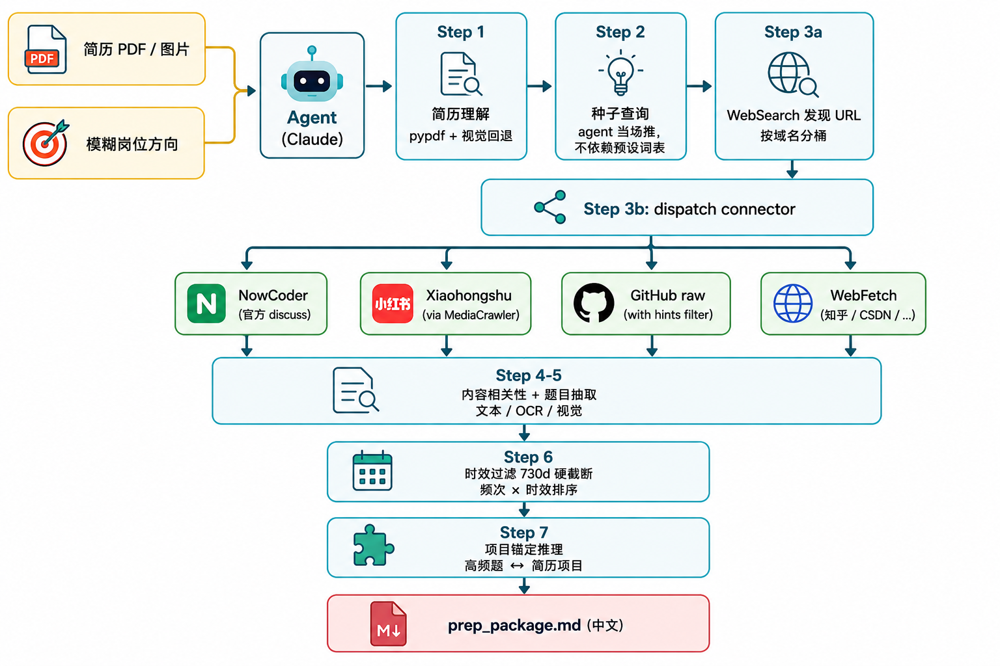
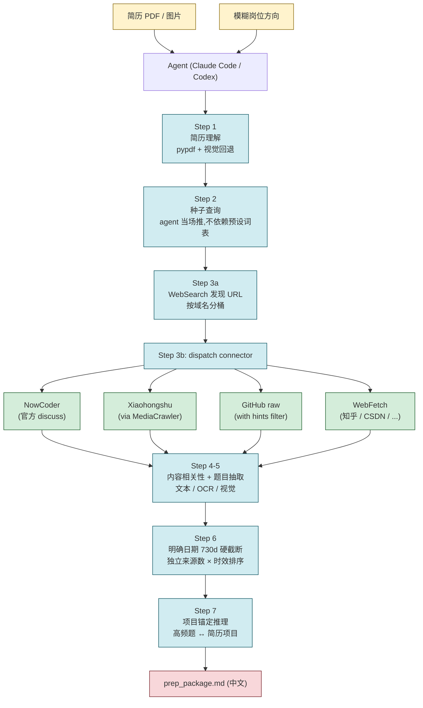

<div align="center">


# InterviewRadar · 面试雷达

**基于真实面经,从你的简历自动生成项目锚定的个性化中文面试备考包**

[](https://github.com/KunChen1110/InterviewRadar/actions/workflows/tests.yml)
[](LICENSE)
[](#)
[](#)

</div>

---

## 它解决什么问题

市面上的"面试题库"几乎都是静态的,而面试官手里的题是动态的、时效的、个性化的。

- 你刷的 1000 道八股题里,**真正会被问到的可能不到 10%**——因为面试官是按你简历来问的,不是按题库目录
- 牛客 / 小红书的真实面经满天飞,但**没人帮你从里面挖出"跟你简历相关、且最近半年高频"的那一小撮**
- LLM 直接生成的面试题听起来像那么回事,但**没法溯源**——你不知道这道题真有人被问过吗

InterviewRadar 是一个可给 Claude Code 或 Codex 使用的面试准备工作流,把"你给的"变成"它给你的":

| 你给的 | 它做的 | 它给你的 |
|---|---|---|
| • 简历(PDF / 图片 / 扫描件)<br>• 一句**模糊**岗位方向<br>&nbsp;&nbsp;&nbsp;&nbsp;(例:"AI 应用开发""市场实习") | • 多源抓取真实面经<br>&nbsp;&nbsp;&nbsp;&nbsp;(牛客 + GitHub + 公开博客)<br>• 对明确日期执行近两年**硬过滤**<br>• 校验题目对应的原文证据片段<br>• 独立来源数 × 时效加权排序<br>• 无日期补充源保留但降权<br>• 把每道高频题尝试**挂到你简历里的项目**上<br>• LLM 推理 + Python 脚本各司其职<br>&nbsp;&nbsp;&nbsp;&nbsp;(领域无关,不依赖预设词表) | • 一份中文 Markdown **备考包**<br>• **可追溯**的、锚定到你项目的<br>&nbsp;&nbsp;&nbsp;&nbsp;**连环追问链**,而不是凭空编<br>• **任意领域**都能跑——不止 AI 岗 |

## 看一眼输出

> 给一份"3 个项目、目标 Agent 应用开发岗"的简历,跑出来长这样(节选):

```markdown
## 2. 简历 ↔ 岗位 Gap 分析

| 维度 | 现状 | 评级 |
|---|---|---|
| Agent Orchestration | P1 已实现多阶段状态机 | ✅ 强 |
| MCP 协议 | 简历未提 | ❌ 弱 |
| Function Calling 工程细节 | 没专门讲 | ⚠️ 中 |
...

## 4. 个性化项目追问链(锚到你的简历)

### 链 4.1 — 高频题 #3 → P1 多阶段状态机

> Q1: "你 P1 项目里设计了 Understanding → Diagnose → ... 这套状态机,
>      具体是怎么拆解出这六个阶段的?"
> Q2: "这套流程对应 ReAct / Plan-and-Execute / Reflexion 里的哪种范式?"
> Q3: "哪个阶段最容易出问题?你是怎么调的?"
```

完整样例:见 [`examples/sample_prep_package.md`](examples/sample_prep_package.md)

## 快速开始

### Claude Code 使用

**前置**:已安装 [Claude Code](https://claude.ai/code)。

```bash
# A. 一行安装(需 npm,-g = 全局)
npx -y skills add https://github.com/KunChen1110/InterviewRadar -a claude-code -g

# 或 B. 手动 clone
git clone https://github.com/KunChen1110/InterviewRadar.git ~/.claude/skills/interview-radar

# 装 Python 依赖
cd ~/.claude/skills/interview-radar
python3 -m venv .venv
.venv/bin/python -m pip install -U pip
.venv/bin/python -m pip install -r requirements.txt
```

在 Claude Code 里调用:

```
用 interview-radar 跑一下:
简历 /path/to/your-resume.pdf
方向:AI 应用开发岗
```

### Codex 使用

Codex 不需要走 Claude Skill 安装器。把仓库 clone 到本地,进入项目目录,安装 Python 依赖即可:

```bash
git clone https://github.com/KunChen1110/InterviewRadar.git
cd InterviewRadar
python3 -m venv .venv
.venv/bin/python -m pip install -U pip
.venv/bin/python -m pip install -r requirements.txt
```

在 Codex 里直接说:

```text
按这个项目的 SKILL.md 跑 InterviewRadar:
简历 /path/to/your-resume.pdf
方向:AI 应用开发岗
```

Codex 会读取仓库里的 `SKILL.md`,调用 `scripts/` 下的确定性脚本,并把结果写到 `corpus_cache/prep_package.md`。如果你已经在这个仓库工作区里,不需要额外安装 skill,直接让 Codex 按 `SKILL.md` 执行即可。

Agent 会自动:
1. 读简历(支持文字 PDF + 图片 + 扫描件)
2. 用 WebSearch 发现牛客 / 公开正文页 URL
3. 按域名分桶,调对应 connector 抓取
4. 校验题目 URL、原文片段和来源时效
5. 按独立来源数×时效排序
6. 项目锚定生成追问链并输出中文备考包

### 默认数据源(零配置)

| 源 | 拿到什么 |
|---|---|
| 牛客(NowCoder) | 真实面经帖,带 createTime |
| GitHub | 主流面经仓库的 markdown 题库 |
| 知乎 / CSDN / 博客类 | 通过 agent 的网页读取能力拉正文页 |

默认文本源不需要额外爬虫配置。实际覆盖度取决于目标岗位、公开页面可访问性和源站反爬状态;任何降级都会在备考包里明确说明。

<details>
<summary><b>(进阶,可选)接入小红书源</b></summary>

小红书面经笔记很多,但平台反爬严,**不能直接抓**——需要一次性配置 MediaCrawler。配完之后 agent 会通过本项目 connector 自动调用,**不用每次手动跑**。

```bash
# 一、安装 MediaCrawler(默认路径 ~/.mediacrawler)
if [ ! -d "$HOME/.mediacrawler" ]; then
  git clone https://github.com/NanmiCoder/MediaCrawler.git ~/.mediacrawler
fi
cd ~/.mediacrawler

python3.11 -m venv venv || python3 -m venv venv
venv/bin/python -m pip install -U pip
venv/bin/python -m pip install -r requirements.txt
venv/bin/python -m playwright install chromium

# 二、复制小红书 web_session 到配置文件
# 打开 ~/.mediacrawler/config/base_config.py,改这几行:
# LOGIN_TYPE = "cookie"
# COOKIES = "web_session=<你从浏览器复制的 web_session 值>"
# ENABLE_CDP_MODE = False
# ENABLE_GET_COMMENTS = False

# 三、验证
venv/bin/python main.py --platform xhs --lt cookie --type search --keywords "AI应用开发 面经" --save_data_option json --get_comment no
```

成功后会生成 `~/.mediacrawler/data/xhs/json/search_contents_*.json`。如果你看到 `zsh: command not found: pip`,不要装全局 pip,用上面的 `venv/bin/python -m pip ...`。

小红书有两种读取深度:

| 模式 | 读取内容 | 适合场景 |
|---|---|---|
| fast | 标题、正文 caption、标签、发布时间 | 快速召回、确认登录和关键词是否跑通 |
| deep | fast 内容 + 按顺序下载图片并 OCR | 正式生成备考包。小红书很多面经正文只放一部分,完整题目在图片里,这种必须用 deep |

所以报告里会标注本次小红书源用的是 `fast` 还是 `deep`。如果只跑了 fast,结论只能代表文字区可见内容,不能当作完整小红书面经覆盖。

完事。Claude Code 或 Codex 接下来要小红书数据时会自动 shell out 调 MediaCrawler。登录过期前不用再管。

详见 [`docs/setup/mediacrawler.md`](docs/setup/mediacrawler.md)。MediaCrawler 仅供个人非商用。

</details>

## 它怎么工作

<div align="center">
  
</div>

<details>
<summary>等价的 Mermaid 流程图(技术细节)</summary>



</details>

**分工原则**:
- agent(Claude Code / Codex)做**推理判断**:领域知识、种子词生成、URL 分桶、项目锚定
- Python 脚本做**确定性脏活**:HTML 解析、时效过滤、去重排序、降级处理
- 两者通过磁盘 JSON 解耦,可独立调试

## 它的差异化

| | 静态题库(JavaGuide / Xiaolincoding / GitHub repo) | LLM 直接出题 | **InterviewRadar** |
|---|---|---|---|
| 时效 | ❌ 经常陈旧 | ⚠️ 不可控 | ✅ 明确日期 730d 硬过滤;无日期降权 |
| 个性化 | ❌ 不看你简历 | ⚠️ 听起来像但不溯源 | ✅ 项目锚定 + `is_grounded` 标记 |
| 可追溯 | ✅ 但散落 | ❌ 编的就是编的 | ✅ 源链接 + 原文证据片段校验 |
| 跨领域 | ❌ 一仓一岗 | ✅ | ✅(不依赖预设词表) |
| 多源 | ❌ 单一 | ❌ 不爬 | ✅ 牛客 / GitHub / 通用正文页(小红书可选) |

## 项目结构

```
InterviewRadar/
├── SKILL.md                     ← Claude Code / Codex 的入口工作流
├── scripts/
│   ├── resume_extract.py        简历理解(文本/视觉回退)
│   ├── connectors/              source connectors:
│   │   ├── nowcoder.py            ├─ 牛客 (选择器漂移守卫 + anti-bot 半空守卫)
│   │   ├── xiaohongshu.py         ├─ 小红书 (吃 MediaCrawler 导出)
│   │   └── github.py              └─ GitHub (relevance_hints 过滤算法噪音)
│   ├── corpus/
│   │   ├── store.py             RawPost / Question / 抽题审计产物存取
│   │   ├── recency.py           时效过滤(730d)
│   │   ├── dedupe_rank.py       规范问题去重 + 独立来源数×时效排序
│   │   ├── quality.py           原文证据校验 + 过滤排序入口
│   │   └── extraction.py        原文候选切分 + 受约束语义决策落题
│   ├── ocr/
│   │   ├── extract.py           OCR + 视觉回退
│   │   └── xhs_images.py        小红书图片下载 + OCR 拼接
│   └── scrape/normalize_xhs.py  MediaCrawler 输出适配器
├── tests/                       单测(TDD)
├── docs/
│   ├── specs/                   设计文档
│   ├── plans/                   实施计划
│   └── setup/mediacrawler.md    小红书源接入指引
├── examples/                    跑通的样例输出
└── corpus_cache/                运行时产物(gitignored)
```

## 开发

```bash
# 跑所有测试
.venv/bin/python -m pytest tests/ -v

# 跑某个 connector 的测试
.venv/bin/python -m pytest tests/test_nowcoder_connector.py -v
```

**怎么加新源**:实现 `Connector` ABC(见 `scripts/connectors/base.py`),返回 `SearchResult`。降级时用 `SearchResult.degraded(name, msg)`,绝不抛异常打断管道。

**怎么调整时效窗口 / 排序权重**:见 `scripts/corpus/recency.py` 和 `scripts/corpus/dedupe_rank.py`,纯函数,容易改 + 测试覆盖好。

## Roadmap

- [x] **小红书 live 采集**:MediaCrawler cookie driver 已接入,支持按关键词自动抓取小红书 notes JSON,并进入 `XiaohongshuConnector`。
- [x] **小红书基础适配**:MediaCrawler 原生 JSON 已能 normalize 成 `RawPost`,支持标题、正文、时间戳、图片 URL。
- [x] **Plan 7:小红书图片面经补全**:`image_list` 会按顺序下载到 `corpus_cache/assets/xhs/{note_id}/`,优先用图片 OCR 作为 `RawPost.raw_text/content_text` 主正文;标题、caption、tags 只进入 `locator_text`,并保留低置信度 vision fallback。
- [x] **题目证据校验**:`QuestionEvidence` 保存来源 URL 和原文片段;`prepare_questions()` 会拒绝不存在、过期或无法在正文中定位的证据,再进入去重排序。
- [x] **Plan 8:证据优先自动抽题**:`extract_candidates()` 先生成不可变原文候选,agent 只提交是否保留、语义归一和岗位标签;`materialize_questions()` 从候选构造题面和 evidence,再进入 `prepare_questions()`。每轮候选与决策都会落盘,方便核查和复跑。
- [x] **Plan 9:可复放语料 runner + CI**:输入已归一化的 `raw_posts.json` 和显式 `extraction_decisions.json`,一次生成带 SHA-256 manifest 的独立运行包（候选、落题、排序题、拒绝项和诊断）。它不隐藏浏览器采集、Agent 判断或最终备考文案，正式包只消费 `ranked_questions.json`。
- [ ] **Plan 10:抖音图文/视频源 MVP**:优先通过 MediaCrawler 接入抖音图文、标题、描述、评论文本;视频 ASR 先做接口与降级提示,确认高密度面经后再接完整转写。
- [ ] **持久化术语词典**:跨 session 累积岗位名、公司名、技术词和真实高频术语,用于下一轮查询扩展。
- [ ] **评测体系**:Golden Set + Trace 回放,覆盖 OCR 抽题、自动抽题、排序和备考包生成质量。

## 贡献

欢迎 issue / PR。开发流程一律走 `docs/specs/` → `docs/plans/` → TDD → 二阶段 review。可以翻看 `docs/plans/` 找现成的范本。

## Star History

[](https://www.star-history.com/#KunChen1110/InterviewRadar&Date)

## 免责

仅供个人非商用。使用本工具拉取数据的合规性由用户自担。详见 [DISCLAIMER.md](DISCLAIMER.md)。

## License

MIT © 2026 Kun Chen
